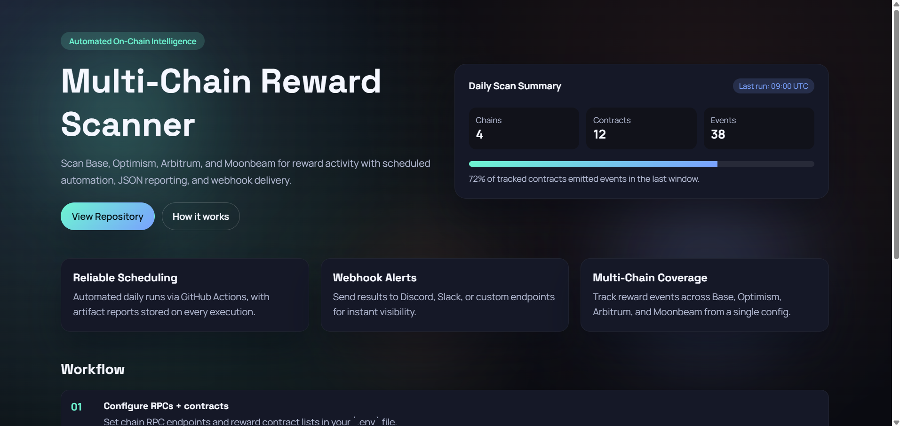

# Multi-Chain Reward Scanner

Professional-grade, multi-chain reward event scanner with scheduled automation, JSON reporting, and webhook delivery.

## Highlights

- Multi-chain scanning (Base, Optimism, Arbitrum, Moonbeam)
- Daily scheduled scans via GitHub Actions
- JSON report generation with timestamps
- Webhook notifications (Discord, Slack, custom)
- Production-ready configuration and docs

## Project Structure

```
multi-chain-reward-scanner/
  .github/workflows/       automation + CI
  src/scan.js              main scanner logic
  reports/                 generated reports (JSON)
  sample_reports/          sample output
  .env.example             configuration template
```

## Quick Start

### Prerequisites

- Node.js 24+
- npm

## Web Page (GitHub Pages)

Professional landing page is available under `docs/`.

Steps:
1) GitHub → Settings → Pages → Source: Deploy from branch.
2) Select `main` and `/docs`.
3) Save. Your page will be live at:
`https://adrijan-petek.github.io/multi-chain-reward-scanner/`

### Install

```bash
npm install
```

### Configure

```bash
copy .env.example .env
```

Update `.env` with RPC URLs and per-chain contract lists.

### Run (Live)

```bash
npm run scan:once
```

### Run (Offline / Dry)

```bash
npm run scan:dry
```

## Configuration

`.env.example` supports per-chain reward contracts:

```
REWARD_CONTRACTS_BASE=0x...
REWARD_CONTRACTS_OPTIMISM=0x...
REWARD_CONTRACTS_ARBITRUM=0x...
REWARD_CONTRACTS_MOONBEAM=0x...
```

Other settings:

- `SCAN_BLOCK_WINDOW` (default 500)
- `SCAN_WEBHOOK_URL` (optional)
- `REPORT_DIR` (default `reports`)

## Reports

Reports are written to `reports/report-<timestamp>.json`. See `sample_reports/report-sample.json` for structure.

## Automation

GitHub Actions:

- `.github/workflows/daily-scan.yml` runs daily on a cron schedule
- `.github/workflows/ci.yml` runs a dry scan on every push/PR

### Required Secrets

- `BASE_RPC`
- `OP_RPC`
- `ARBITRUM_RPC`
- `MOONBEAM_RPC`
- `REWARD_CONTRACTS_BASE`
- `REWARD_CONTRACTS_OPTIMISM`
- `REWARD_CONTRACTS_ARBITRUM`
- `REWARD_CONTRACTS_MOONBEAM`

Optional:

- `SCAN_BLOCK_WINDOW`
- `SCAN_WEBHOOK_URL`

## Webhooks

If `SCAN_WEBHOOK_URL` is set, the full report JSON is posted after each run.

## Troubleshooting

- Lower `SCAN_BLOCK_WINDOW` if RPC providers rate-limit requests.
- Ensure contracts exist on the chain you scan.
- Use an archival RPC for historical lookbacks.

## License

MIT
